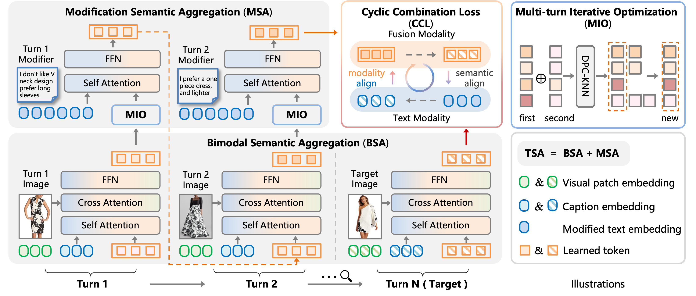

# **MAI: A Multi-turn Aggregation-Iteration Model for Composed Image Retrieval**

This is the source code of our ICLR 2025 paper "[MAI: A Multi-turn Aggregation-Iteration Model for Composed Image Retrieval](https://openreview.net/forum?id=gXyWbl71n1&referrer=%5BAuthor%20Console%5D(%2Fgroup%3Fid%3DICLR.cc%2F2025%2FConference%2FAuthors%23your-submissions))".



## Installation

```bash
conda env create -f environment.yml
source activate Real
```

## Dataset


We release the entire section of the FashionMT dataset and conducted experimental comparisons for [our paper](https://openreview.net/pdf?id=gXyWbl71n1) on this dataset. 

To facilitate downloading of this dataset, we will provide a **Baidu Netdisk download link**. **Please note**:

**As we are actively preparing the extended journal version of this work, the full dataset, complete code, and its organization will be released after the journal submission to avoid potential conflicts. Please stay tuned to the [MAI code repository](https://github.com/ChenAnno/MAI_ICLR2025).**

## Quick Start

- **src**: Includes model code, dataset loading code, loss function code, etc. (pending organization).
- **scripts**: Contains simple case implementations for dataset construction (pending organization).

Please note:

1. Please note to **complete the path** at the beginning of the following script files.
2. The training code is built on PyTorch with DistributedDataParallel (**DDP**).
3. We pretrain the framework on 2 nodes, each with 8 V100 GPUs.

```bash
# Train the MAI framework.
sh train.sh

# Evaluate on the FashionMT dataset.
sh validate.sh
```

## Model Wights

We will open-source the model weights and provide a link to access them in the **Baidu Netdisk download link**.

Please download and put the checkpoints under: `outputs/checkpoints/`, `pretrain.pth.tar` is the pre-trained model, while `checkpoint.pth.tar` is the model that achieves the SOTA results.

## Citation

If you find our work helps, please cite our paper.

```bibtex
@inproceedings{chenmai,
  title={MAI: A Multi-turn Aggregation-Iteration Model for Composed Image Retrieval},
  author={Chen, Yanzhe and Yang, Zhiwen and Xu, Jinglin and Peng, Yuxin},
  booktitle={The Thirteenth International Conference on Learning Representations}
}
```

## Contact

This repo is maintained by [Yanzhe Chen](https://github.com/ChenAnno). Questions and discussions are welcome via `chenyanzhe@stu.pku.edu.cn`.

## Acknowledgements

Our codes reference the following projects. Many thanks to the authors!

- [SPRC](https://github.com/chunmeifeng/SPRC)
- [CLIP](https://github.com/openai/CLIP)
- [CLIP-Chinese](https://github.com/yangjianxin1/CLIP-Chinese)
- [OpenFashionCLIP](https://github.com/aimagelab/open-fashion-clip)
